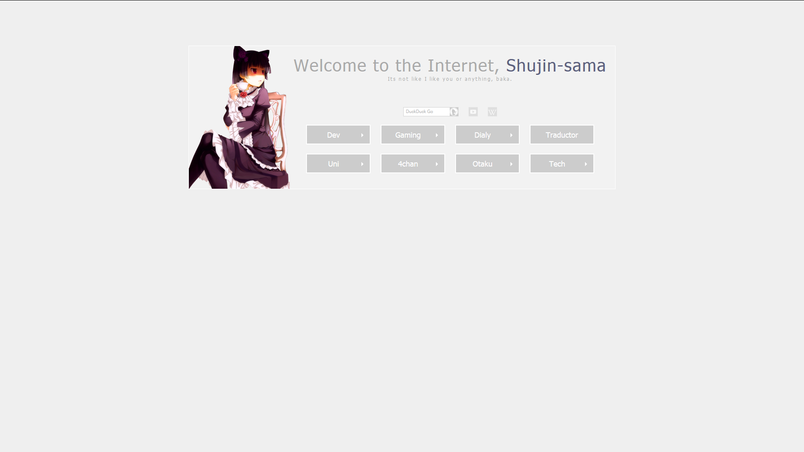

Homepage
====



**Live Demo from original creator: [Dark](http://gokoururi.github.io/homepage/) - [Light](http://gokoururi.github.io/homepage/index-light.html)**

This repository contains a custom homepage made using html, css and javascript. Feel free to download and modify. Comments and suggestions appreciated.

Features:
* Flashy links
* Flashy Slidy sublinks
* Flashy Slidy searchbars 
* Randomly selected cute 2D girls
* Column style links.
* **New**: Light color theme. See [Live Demo](http://gokoururi.github.io/homepage/index-light.html)

Customizing and adding mascots
----

To customize mascots modify the following values in [javascript](js/scripts.js):

```javascript
    var mascotEnable    = true;
    var mascotPath      = "images/mascots/"
    var mascotList      = [ 'ruri1.png', 'ruri2.png', 'ruri3.png' ];
```
